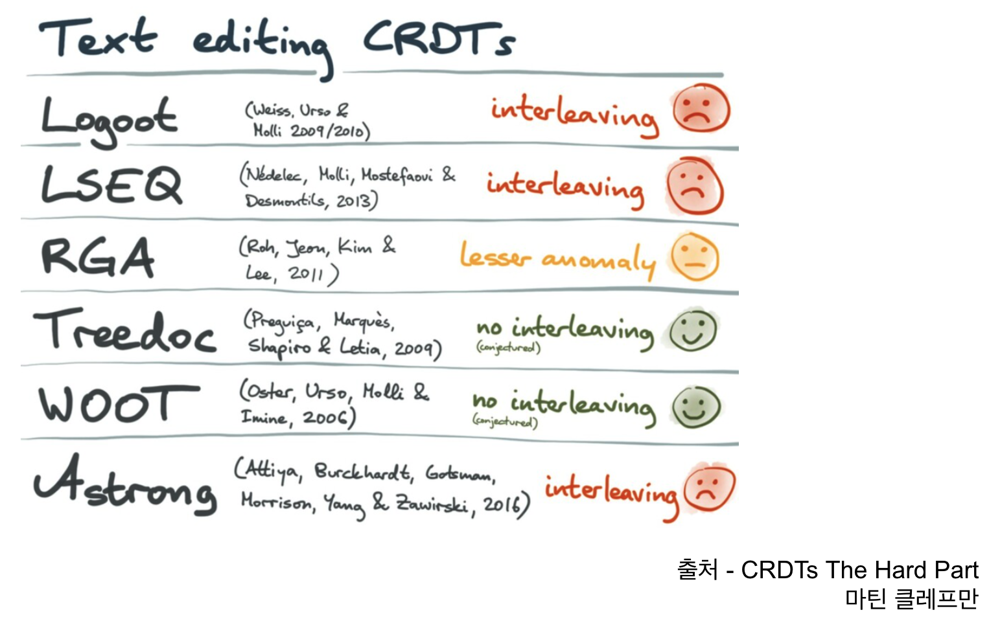

내가 멘티로 참여하고 있는 OSSCA Yorkie팀의 멘토로 계신 [이진호](https://github.com/binary-ho)님의 발표를 듣고 정리한 내용이다. 이미지는 진호님의 발표 ppt에서 따온 게 대부분이다.

오늘날 노션, 피그마, 슬랙, excalidraw, 구글독스 등 동시 편집을 지원하는 다양한 툴들이 있다.

여러 사람이 동시에 같은 내용을 편집하고 그게 제대로 반영되도록 하는 게 쉽지 않으리라는 건 예상할 수 있다. 그런데 구체적으로 어떤 어려움들이 있었을까? 그리고 그 어려움들은 어떻게 극복되어 왔을까?

## 협업의 역사

동시 편집은 일단 나중에 생각하기로 하고, 작업 내용을 어떻게 주고받으면서 협업했을지 그 협업의 역사에 대해 먼저 생각해보자.

처음에 개발자들이 협업을 할 때는 파일로 주고받았다. 조별과제 같은 걸 하면서 `진짜_최종`, `진짜최종_최종`같은 파일들을 주고받아본 경험담이 흔한데 이런 걸 생각하면 된다.

(옛날 개발자들의 수기를 보면 당시 운영체제의 호환성 등으로 인해 이런 파일을 주고받다 문제가 생긴 이야기 등도 볼 수 있다)

개발 협업을 해본 사람이라면 이해하겠지만 이러면 서로 겹치는 부분을 작업했을 때 매우 힘들어진다.

이후에는 git을 이용해 충돌 감지를 할 수 있게 됐다. 어디서 같은 부분의 편집이 일어났는지 확인하고 개발자가 선택할 수 있게 개선되었다.

하지만 실시간으로 함께 작업을 해야 한다면?? 이제 "실시간 동시 편집 툴" figma, notion등이 등장한다. 이런 툴들은 실시간으로 다른 사람의 작업을 보고 코멘트를 남길 수도 있다.

## 실시간 동시 편집 툴 구현의 어려움

대부분의 개발자들이 이걸 잘 쓰고 있다. 하지만 이런 동시 편집 알고리즘을 직접 개발한다면 어떨까? 어렵겠지. 하지만 어떤 게 어려울지를 생각해 보자.

어려움을 따지려면 먼저 동시 편집이란 게 어떤 상황을 마주하는지 알아야 한다.

- 모두가 보고 있는, 공유되고 있는 원본 데이터가 있다
- 이 원본 데이터는 변경 가능하고 여러 사람이 이를 수정 가능하며 각자의 수정 내역은 모두에게 공유되어야 한다
- 인터넷, 네트워크 등을 통해 이 수정 내역을 주고받는다

이 3가지가 같이 있는 게 모든 어려움의 시작이다. 동시성, 시간 문제, 부분 단절 문제 등등이 발생한다.

예시로 만약 이 수정 내역이 공유될 필요가 없다면 사실 크게 어려운 점이 없다. 그냥 내 로컬에서 변경 사항을 저장하고 있으면 그만이다.

그럼 이 "수정 내역이 전체에게 공유되어야 한다"는 건 어떤 문제를 발생시키는 걸까? 흔한 동시성 문제다...

보통 티켓 예시를 많이 든다. 티켓이 2장 남아 있고 내가 1장을 사고 싶다고 하자. 그러면 과정은 이런 식으로 진행된다.

1. 티켓이 몇장 남았는지 확인
2. 감산 가능하면 티켓을 감산
3. 티켓을 1장 줄인 값으로 저장

코드로 나타내면 아마 이렇다.

```js
function buyTicket(customerId) {
  // 티켓이 2장 남아 있으므로 2일 것
  const ticketCount = getTicketCount();
  if (ticketCount > 0) {
    // DB에 저장된 티켓 값을 2 - 1 그러니까 1로 업데이트
    updateTicketCount(ticketCount - 1);
  } else {
    throw Error("티켓이 매진되었습니다.");
  }
}
```

이런 걸 나 혼자 하면 괜찮은데 10명이 동시에 한다고 하면 문제가 생긴다. DB 값이 업데이트되기 전에 요청이 몰리므로 모든 요청이 "남은 티켓은 2장"이라는 정보를 기반으로 처리되어서 DB에 업데이트된 남은 티켓 수는 1인데 10명이 티켓을 받아버리는 문제가 터지는 것이다.

근데 우리는 티켓을 관리하는 게 아니라 문서 동시 편집을 다루고 있다. 문서 동시 편집에도 이런 문제가 발생할까? 당연하다. 같은 곳을 고치고 있을 수도 있으니까. 문서는 아니지만 세계지도에 픽셀 아트를 그릴 수 있는 [wplace](https://wplace.live/)같은 서비스를 생각해 보면 특정 지역의 편집을 두고 수많은 온라인 전쟁이 벌어지지 않았나?

이런 경합을 해결하는 방법은? 기본적으로 값의 확인, 변경, 저장 과정을 한번에 하도록 하는 것이다.

- 데이터 조작 주체 제한. 락을 걸어서 한번에 1명만 편집 가능하게 한다.
- 최신값이 아닌 경우 재시도. 각 값의 버전을 관리하여 값의 버전을 보고 최신값이 아닌 경우 재시도를 하도록 한다

문제는 이런 방법들이 너무 느리다는 것이다. 이런 요청을 주고받는 네트워크도 느리고, 락도 대부분의 경우 느리다. (늘 그런 건 아니긴 하지만 -[Locks Aren't Slow; Lock Contention Is](https://preshing.com/20111118/locks-arent-slow-lock-contention-is/)- 락이 없는 것보다 일반적으로 느리다는 건 부인할 수 없다)

이런 문제를 극복하고 아주 빠른 동시 편집 툴을 만들 수 있을까? 우리는 이미 답을 알고 있다. figma, 노션 등의 동시 편집이 이미 굉장히 빠르게 동작하고 있음으로써 증명하고 있다.

## 개선 방식들

### Local first remote later

각 유저는 로컬에서 문서 복제본을 가지고 있고 이를 편집하도록 한다. 그리고 주기적으로 원격 저장소에 보내서 원격에 있는 문서에 수정 사항을 반영한다. 이렇게 하면 유저는 로컬에서 고치는 것처럼 빠르게 변경을 할 수 있고 원본문서에는 적당한 간격으로 반영된다.

좋기는 한데 여전히 동시성 문제가 발생한다. 내가 고친 곳이 원격에 반영되기 전에 다른 사람이 또 고쳤다면? 여러 곳에서 데이터를 관리하면서 더 동시성 문제가 심각해졌다.

### Operational transformation

중앙 서버에서 중재를 해주자. 한녀석이 다 정리하게 하는 것!

근데 이렇게 하면 문서 동시 편집의 경우 의도가 유지되지 않는 문제가 있다. 가령 두 명이 같은 위치에 바보/천재를 함께 넣었으면 insert index가 뒤섞여서 "바천보재"같은 이상한 내용이 될 수 있다.

즉 인덱스가 밀려나거나 변경된 만큼 조정을 해줘야 하는 문제 발생 -> 버퍼 안 operation들의 인덱스를 순서에 맞게 변환(transformation)해야 한다. 그래서 이름이 operational transformation이다.

근데 문제가 있음.

- 중앙 서버에 부하가 너무 큼. 변경 연산들을 정렬하는 건 복잡도가 크다.
- 발생 가능한 경우의 수가 너무 많아서 알고리즘이 너무 어렵다.

### CRDT

Conflict-free Replicated Data Type

강한 최종적 일관성(strong eventual consistency)을 갖도록 정렬하는 기준을 세우는 인터페이스라고 할 수 있다. 업데이트 요청의 순서랑 상관 없이 변경 연산의 집합이 동일하면 결국 동일한 결과로 수렴하도록 하는 기능을 한다.

- 모든 읽기작업은 항상 가장 최근에 완료된 데이터를 반환한다
- 모든 복제본은 결국 동일한 쓰기 값으로 수렴한다

근데 이게 무슨 말일까? 예를 들어 어떤 정수 데이터 하나가 있고 "1을 더하기"라는 연산과 "1을 빼기"라는 연산이 있다고 생각해 보자. 같은 연산들의 집합이 있다면 어떤 순서로 해도 결과는 같을 것이다. 초기 데이터가 0이고 "1을 더하기" 연산 10번, "1을 빼기" 연산 7번을 한다면 순서에 상관없이 결과는 3이다.

물론 문서 편집은 이렇게 단순한 경우만 있지 않다. 하지만 "어떻게 형성되었든 결과적으로 적용하는 연산의 집합이 같다면 결과가 같다"는 점만 놓고 보자.

이런 식으로 편집 연산의 입력 순서에 상관없이 동일한 결과물이 나올 수 있도록 하면 동시 편집 문제를 해결할 수 있다. 왜냐? 각 유저가 변경 연산들을 어떻게 입력하든 상관 없이 늘 똑같은 변경 결과물이 나올 거기 때문이다.

문제는 어떻게 이를 할 것이냐는 건데 이건 연산들을 정렬하는 순서를 세우면 된다. 어떤 순서로 입력이 들어와서 만들어진 변경 사항 집합이든 같은 집합이라면 늘 같은 순서로 정렬되도록 하고 그 순서대로 적용하기만 하면 끝이다.

이것만 할 수 있으면 된다. 이건 또다른 성능의 이점도 있다. 이 연산의 적용을 로컬에서 처리할 수 있기 때문에(어차피 같은 연산 집합이면 같은 결과로 정렬되기 때문에 원격에서 정렬하든 로컬에서 하든 같다) 중앙 서버 부하도 줄일 수 있다.

이를 위해서는 변경 연산들이 교환법칙, 결합법칙, 멱등성을 만족하도록 구현하면 된다! 이를 위해서는 연산들을 일종의 우선순위 정렬을 거치도록 한 후 연산하도록 한다.

연산의 정렬을 위해서는 보통 논리 시계라는 걸 사용한다. Yorkie에서는 Lamport clock이라는 걸 쓰고, 연산들이 갖는 우선순위가 늘 일관되도록 하여 같은 연산 집합이면 같은 순서로 정렬되도록 수학적으로 잘 정의되어 있다고 한다.

그런데 왜 진짜 시간을 쓸 수 없을까? 그냥 입력된 순서대로 정렬하면 모든 연산이 시간순으로 정렬도 되고 좋지 않을까? 분산 시스템에서 시간을 따지는 건 사실 굉장히 힘들다...컴퓨터는 크리스탈 진동을 통해 시간을 판단하고 NTP(Network Time Protocol)를 이용해서 주기적으로 시간 정확도를 보완한다. 근데 우리는 인터넷을 통해서 하고 있기 때문에 시간을 통해 선후를 따지기가 어렵다. 이런 이유로 진짜 시간 대신 논리 시계, 벡터 시계를 사용한다.

결국 중요한 건 정렬 규칙을 정해서 받는 시간에 상관없이 "최종적으로 같은 결과로 수렴하도록"하는 것

장점

- OT보다 시간 복잡도 낮고 중앙서버 부하 X(정렬이 로컬에서 규칙대로 일어나므로)
- 분산 네트워크, 장애에 강함. 어차피 정렬 규칙에 따라 정렬 결과는 똑같이 수렴하기 때문에 특정인의 변경사항이 어떤 네트워크 문제 등으로 인해서 나중에 전파되더라도 결국 똑같은 결과를 낼 수 있음
- 이론상 P2P 가능. 정렬 규칙만 서로 정해져 있으면 편집 결과물의 수렴은 똑같이 하기 때문에 중앙 서버도 없어도 된다(물론 중앙 서버가 있으면 구현 복잡도가 많이 줄어든다)

또한 인덱스를 소수점으로 정의하는 등(figma에서 사용하는 알고리즘) 여러 베리에이션도 가능

한계

- 물론 의도를 반영해서 동시 편집을 하는 건 여전히 좀 힘듬(interleaving)

근데 이 한계를 극복하는 게 가능하다. CRDT는 변경사항들의 정렬을 위한 일종의 인터페이스일 뿐이기 때문이다. 정말 단순하게는 last write wins 식으로 정렬할 수도 있다! 따라서 구현체에서 강한 최종적 일관성의 구현을 다양한 방식으로 할 수 있고 이를 통해 interleaving과 같은 한계도 해결할 수 있다.

다양한 구현체가 나와 있다.



TreeDoc, WOOT 등은 interleaving 문제를 겪지 않지만 매우 느리다. 따라서 이런 인터리빙을 좀 해결하면서도 상대적으로 빠른 RGA를 Yorkie에서는 채택하고 있다. 한국 사람이 만든 알고리즘이다.

### RGA의 아이디어

어떤 글자는 다른 글자의 뒤에 있다는 당연한 사실에서 출발한다. "자기 앞의 글자" 그러니까 자기가 누구의 뒤에 있어야 하는지를 각 글자가 가지고 있다.

그리고 정렬에서의 경합이 "같은 인덱스에 삽입되려고 하는 글자"들 사이에서 일어나는 게 아니라 "같은 글자 뒤에 붙으려고 하는 글자 무리들"간에만 일어난다. 예를 들어 '안녕'뒤에 '하세요' 와 '반가워'가 동시에 붙으려고 하는 상황을 가정하자.

그러면 "하세요"의 삽입은 0-based index라고 생각할 때 다음과 같은 연산들의 집합이다

```
insert 2 "하"
insert 3 "세"
insert 4 "요"
```

"반가워"는 다음과 같은 연산들의 집합이다.

```
insert 2 "반"
insert 3 "가"
insert 4 "워"
```

이것의 좋은 정렬 결과 중 하나는 다음과 같다.

```
insert 2 "반"
insert 3 "가"
insert 4 "워"
insert 5 "하"
insert 6 "세"
insert 7 "요"
```

하지만 같은 인덱스에 삽입되려는 글자 간에 경합이 일어난다. 정렬을 하려는 주체는 아마 이런 경합을 마주할 것이다.

```
insert 2 "반" vs insert 2 "하"
insert 3 "가" vs insert 3 "세"
insert 4 "워" vs insert 4 "요"
```

이러면 정렬을 하다가 경합이 제대로 처리되지 않으면 의도가 제대로 반영되지 않고 이런 식으로 이상하게 정렬될 수 있다.

```
insert 2 "반"
insert 3 "하"
insert 4 "세"
insert 5 "가"
insert 6 "워"
insert 7 "요"
```

하지만 두 작성자의 의도는 애초에 글자 단위가 아니다. 어떤 글자 뒤에 다른 글자들을 추가적으로 입력하려는 게 핵심이다. 따라서 RGA는 같은 글자 뒤에 붙으려는 글자 그러니까 `"안녕"뒤에 "하세요"를 붙이기` vs `"안녕"뒤에 "반가워"를 붙이기`사이에만 경합이 일어난다. 따라서 '안녕 반가워 하세요' 정도로 정렬 결과에서 의도가 어느 정도 유지된다.

Yorkie를 비롯하여 이런 동시편집을 구현하는 다른 툴들도 있고, 다른 정렬 방식들도 많다.

### 전망

notion에서도 CRDT 관련 채용 공고를 낸 적 있으며 우리가 잘 아는 피그마, excalidraw, 미리캔버스 등에서도 CRDT를 사용하고 있다. 또한 레디스에서도 내부적으로 crdt를 사용하고 있다고 한다. 따라서 미래 전망은 꽤 밝다고 할 수 있다.

### 여담

RGA의 각 글자 노드가 "자신이 어떤 글자 뒤에 붙는지"를 갖고 있다고 했다. 그럼 맨 첫 글자는 어떻게 할까? -> 더블 링크드 리스트에서 header, trailer가 있듯이 여기도 논리적인 header가 존재한다.

CRDT는 이론상 p2p, 혹은 완전 분산 시스템에서도 동작 가능하다. 하지만 Yorkie에는 중앙 서버가 있는데 이유는? -> CRDT는 물론 이론상 분산 시스템에서 다 처리할 수 있지만 편집을 관리해 주는 중앙 서버가 있으면 기술적 난이도가 훨씬 낮아지고 엣지 케이스도 많이 줄어든다.

## 도움주신 분

[이창희](https://xo.dev/)
