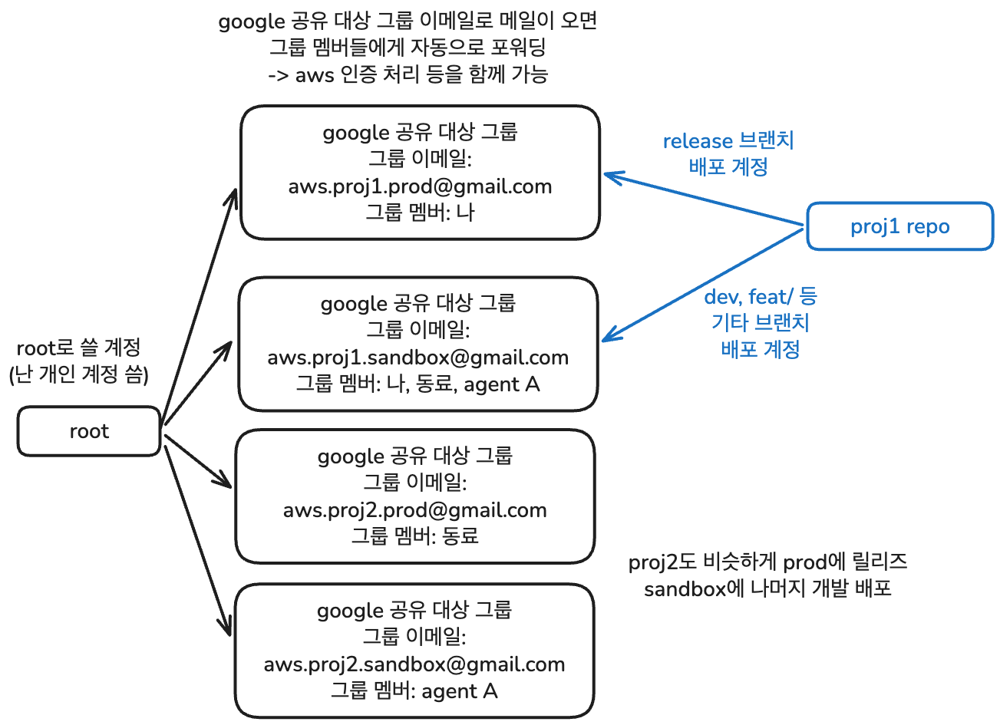
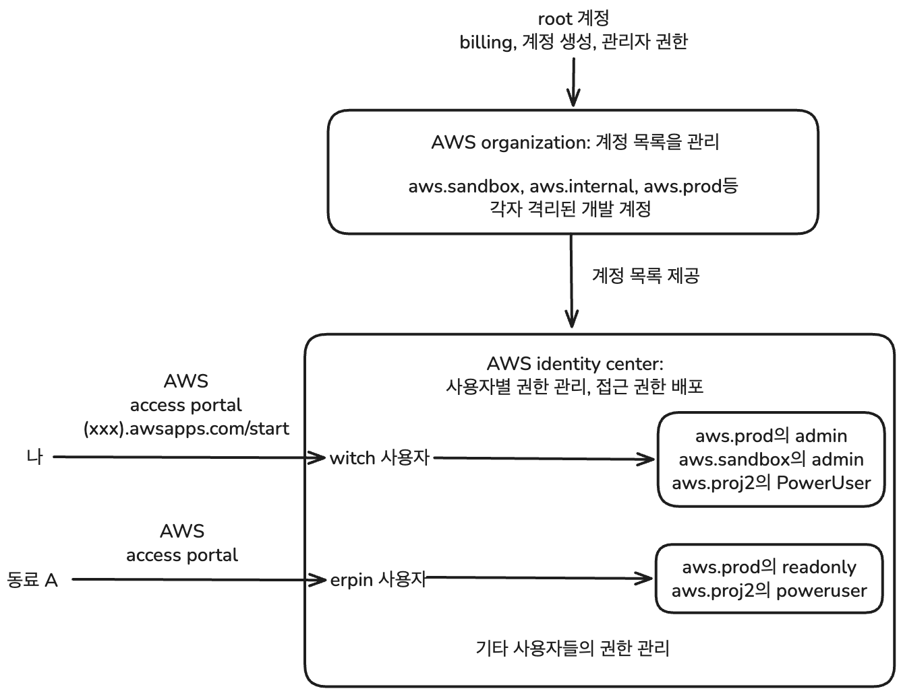

이 내용은 [임완섭](https://github.com/wanseob)님의 엄청난 도움을 받아 작성된 글입니다. AWS 서버리스 세팅의 이점과 계정 기반의 환경 격리 설계, 그리고 실제 세팅 과정에 대한 자세한 설명을 해주셨습니다.

## aws serverless skill

클로드 코드에 aws 서버리스에 관한 스킬이 있다. 클로드 코드를 사용해서 세팅에 도움을 받을 때 사용하자. https://claude.com/plugins/aws-serverless

## 목적

AWS를 이용해서 서버리스로 인프라 세팅을 해보려고 한다. 꼭 서버리스를 사용해야 한다고 생각하는 건 아니지만 aws에서 제공하는 기능들의 장점을 보고 한 번 써보았다.

생각했던 목적은 다음과 같다.

### 타입 공유

개인적으로 가장 크게 달성하고자 했던 목적이다. 프론트엔드 개발을 하다 보면 api의 응답을 위해 이런 식으로 타입을 선언하게 된다.

```ts
type UserResponse = {
  handle: string;
  id: string;
  nickname: string;
  email: string;
  locale: string;
  credit: number;
  // 기타 등등...
};
```

그리고 api를 호출하는 함수를 짜게 된다. 클래스를 이용해 짜기도 하고 역할 분리를 위한 여러 방법이 있지만 핵심이 아니므로 이 정도로 넘어간다.

```ts
export const userApi = {
  getUser: () =>
    api.get<UserResponse>({
      path: "/auth/get-user",
    }),
};

// 이런 식으로 호출
const user = await userApi.getUser(); // user는 UserResponse 타입이 된다.
```

이렇게 하면 서버의 api 응답이 바뀔 시 클라이언트의 Response 타입도 바꿔줘야 한다. 이 과정에서 실수가 생기면 타입 에러는 뜨지 않는데 클라이언트에서 바뀐 응답을 제대로 처리하지 못하는 상황이 생긴다.

근본적인 문제는 클라이언트와 서버의 타입이 분리되어 있다는 것이다. zod를 통해 런타임 유효성 검사를 하고 타입을 생성하든, 제네릭을 이용해서 타입 차력쇼를 하든 클라이언트의 노력만으로는 이를 해결할 수 없다.

그렇다면 프로젝트를 모노레포로 세팅하고 어떤 방법을 이용해서든 서버와 클라이언트에서 타입을 공유할 수 있도록 하면 어떨까? 이전에도 나는 openapi generator 같은 툴을 이용해서 타입을 공유하는 설정을 시도해본 적이 있다. ([장난감 모노레포 삽질기 - 2. 기초적인 TodoList 구현과 타입 공유](https://witch.work/ko/posts/pnpm-workspace-monorepo-2-basic-todolist))[^1]

그런데 aws amplify와 거기 딸려오는 부가 기능들을 이용하면 DB 스키마를 타입의 single source of truth로 삼아서 프론트엔드와 백엔드에서 타입을 공유할 수 있다. 원래 일반적으로는 openapi 명세를 source로 삼았는데 aws amplify는 DB 스키마를 source로 삼는다.

물론 이렇게 amplify를 통해서 세팅하면 락인이 너무 강하게 걸릴 것 같다는 걱정이 있다. 하지만 일단 최대한 cloud agnostic하게 세팅하려고 노력했고, aws에서 제공하는 기능들을 이용해서 세팅하는 것 자체가 재미있을 것 같아서 시도해보았다.

### 인프라 관리

타입스크립트를 좋아하는 프론트엔드 개발자로서는 모노레포 전반의 타입 공유가 매력적이었다. 하지만 인프라의 권한과 여러 서버 관리 측면에서도 좋았다. 이는 이후의 구조를 세팅하면서 좀 더 이야기할 것이다.

### 비용 문제

서버리스, 컨테이너 기반의 서버, 혹은 온프레미스 서버 등등 여러 인프라 옵션에 대한 논쟁이 많다. 하지만 개인적으로는 인프라 관리에 대한 부담 면에서는 부담이 가장 적은 옵션이 서버리스라고 생각한다.

서버리스의 비용에 대한 걱정이 있을 수 있지만 작은 규모의 프로젝트에서는 비용이 그렇게 많이 나오지 않는다. 또한 스케일링에 대한 걱정도 덜 수 있다. 서버리스는 트래픽에 따라 자동으로 스케일링되기 때문에, 트래픽이 갑자기 증가하더라도 인프라가 자동으로 대응할 수 있다.

하지만 직접 서버를 관리한다면? 일반적으로 서버 점유율이 언제나 일정한 서비스는 많지 않다. 예를 들어 내가 재직중인 회사의 서비스는 이벤트 등에 따라 시기별로 트래픽이 상당히 달라질 때가 많고, B2C기 때문에 상식적으로 새벽에는 트래픽이 적다. 이런 경우에는 서버를 직접 관리하는 것보다 서버리스가 더 효율적일 수 있다.

내게 aws를 알려주신 분에 의하면 서버의 평균 점유율이 30% 미만이라면 서버리스가 무조건 더 효율적이라고 한다. 이를 반대로 말하면 서버의 평균 점유율이 30% 이상이라면 서버를 직접 관리하는 게 더 효율적이라는 거다. 하지만 어차피 서버의 평균 점유율이 일정 수준 이상으로 올라가면 스케일업을 해야 한다. 그 관리 비용은 어떡하고?

적당히 평균점유율이 80% 이상일 때 스케일업을 한다고 생각하자. 근데 평균 점유율이 80% 정도 되는 서비스라면 상식적으로 트래픽이 100% 이상으로 튀는 시점이 발생한다. 당장 내가 재직중인 회사의 서비스도 이벤트 시기의 피크타임에는 평시 새벽 4시(트래픽이 가장 적은 편이다)보다 rps가 2.5배 이상으로 가볍게 올라간다.

그럼 평균 점유율이 30%와 80% 사이에서 꾸준히 유지되며 트래픽이 2배 이상 튀는 상황이 절대로 발생하지 않는 서비스에서만 서버를 직접 관리하는 게 더 효율적이라는 건데, 그런 서비스가 과연 얼마나 될까?

## 계정 기반의 환경 격리 설계

aws 세팅과 배포에 들어가기 전에 해야 할 게 있다. 프로젝트마다 aws 계정을 분리해서 관리할 수 있도록 환경을 설계하고 만드는 작업이다.

최종적으로 목표하는 구조는 다음과 같다.



각 계정은 완전히 격리된 독립적인 공간이다. 다른 계정의 리소스에 접근하려면 명시적으로 교차 계정 권한을 설정해야 한다. 계정 자체를 보안 경계로 삼는 것이다. 따라서 sandbox 계정에서 실수로 리소스를 날려도 prod 계정은 전혀 영향을 받지 않는다.

그리고 이렇게 하면 사진처럼 `proj1`에도 프로덕션과 샌드박스 계정을 따로 둘 수 있다. 그럼 샌드박스에는 뭐든지 할 수 있다. release 브랜치만 프로덕션 계정에 배포하도록 하고, 나머지 브랜치(dev, feature 등)는 샌드박스 계정에 배포하도록 하면 된다. 이건 github action 등의 ci/cd 툴로 쉽게 설정할 수 있다.

이를 단순히 개발 서버와 프로덕션 서버를 분리하는 수준으로 생각할 수도 있지만 이런 구조의 진정한 이점은 인프라도 ai를 이용해 관리할 수 있게 된다는 것이다. ai 에이전트는 sandbox 계정에만 접근하도록 제한하면 된다. 그러면 실수로 리소스를 날리는 상황이 발생하더라도 prod 계정은 안전하게 보호할 수 있다. 잘 되었을 경우에만 내가 적당히 검증하고 prod에 배포하도록 하면 된다.

### 계정 만들기

구글의 그룹 기능을 이용하면 그룹의 공유 이메일 주소를 만들 수 있다. admin.google.com에서 그룹을 만들고(디렉토리 -> 그룹 에서 생성) 그룹 이메일 주소를 만들면 된다. `aws.sandbox@gmail.com` 이런식으로 만들었다.

그럼 해당 그룹 이메일로 메일이 오면 그룹 멤버들에게 자동으로 포워딩된다. 따라서 `aws.sandbox@gmail.com`으로 aws 계정을 만들면 `aws.sandbox@gmail.com` 그룹의 멤버들은 모두 해당 계정으로 인증, 배포, 관리할 수 있다. 인증이 이메일로 진행되기 때문이다.

### AWS Organizations 만들기

계정을 이메일로만 관리하면 한계가 있다. 계정마다 따로 로그인하는 것도 불편하고 프로젝트를 런칭하거나 접을 때 일일이 계정을 수정하는 것도 번거롭다. 이를 해결하기 위해 AWS Organizations와 IAM Identity Center를 함께 사용한다. 먼저 Organizations로 계정들을 묶어서 중앙에서 관리할 수 있도록 한다.

root가 전체 계정의 중앙 관리 역할을 하면서 각 계정에 대한 접근 권한을 관리하는 구조다. root는 프로젝트를 직접 올리는 용도가 아니라 billing, 권한 관리, 계정 생성 등의 관리 업무를 담당한다. 나는 내 회사 계정 `witch@wanot.ai`를 root 계정으로 사용하고, `aws.internal`과 `aws.sandbox` 계정을 Organizations에 추가해서 관리하는 구조로 세팅했다.

root로 사용할 `witch@wanot.ai` 계정으로 root 이메일 로그인을 한다. 그리고 Organizations에서 조직을 생성한 후 계정을 추가한다. 나의 경우 `aws.internal`과 `aws.sandbox` 계정을 추가했다.

이때 주의할 점이 하나 있다. "AWS 계정 생성"(조직에 추가되는 AWS 계정을 생성합니다) 기능을 통해 AWS org에 계정을 추가하면 계정이 자동으로 생성된다. 이 경우 비밀번호를 설정하는 절차가 없다. 계정 이름과 `aws.sandbox@wanot.ai` 만 치면 끝이다. 그런데 나중에 CDK bootstrap을 하려고 하면 `aws.sandbox` 계정을 root로 하여 로그인을 해야 한다. 그런데 비밀번호가 없는데 어떡할까? 로그인 화면의 'forgot password' 기능을 이용해서 비밀번호를 설정하면 된다. 번거롭지만 AWS 계정 생성을 통해 org에 추가하면 1번은 거쳐야 하는 과정이다.

### IAM Identity Center로 멀티 계정 관리하기

Identity Center로 권한 관리와 계정을 쉽게 오갈 수 있도록 하자. 구글 계정이 여러 개라면 로그인할 때 어떤 계정으로 로그인할지 선택할 수 있는 그런 방식을 AWS 계정에도 적용할 수 있게 해준다. Identity Center가 제공하는 AWS 액세스 포털에서 내게 할당된 사용자로 로그인하면 내가 접근할 수 있는 계정 목록이 표시되고, 원하는 계정을 선택해서 콘솔에 로그인하거나 CLI용 임시 액세스 키를 발급받을 수 있다.

또한 각 계정은 완전히 독립된 공간으로 기능하고, identity center가 각 계정에 임시 자격 증명을 발급해주는 방식이기 때문에 IAM 액세스 키를 쓰는 것보다 보안적으로도 훨씬 안전하다.

identity center로 가서 활성화하자.

1. 루트 계정으로 AWS 콘솔 로그인
2. 검색창에 IAM Identity Center 검색
3. 서울 리전(ap-northeast-2) 선택하고 활성화

활성화하면 Organizations에 속한 계정 목록이 표시된다. 계정마다 어떤 사용자가 어떤 권한으로 접근할지 설정할 수 있다.

설정은 Identity Center → 다중 계정 권한 → AWS 계정에서 한다. 조직에 속한 AWS 계정 목록이 표시되고, 각 계정에 사용자와 권한 셋을 할당할 수 있다.

권한 셋은 Identity center에서 관리하고 있는 계정에 특정 사용자가 접근할 때 어떤 권한을 가질지를 미리 정의해 놓은 것이다. 권한 셋 생성에서 사전 정의된 정책 중 하나를 선택하면 된다. 나는 `AdministratorAccess`, `PowerUserAccess`, `ReadOnlyAccess` 권한 셋을 만들어서 필요에 따라 할당했다. PowerUserAccess는 관리자 권한은 없지만 대부분의 작업을 할 수 있는 권한 셋이다. 이후 ai agent에 할당하면 좋을 듯 하여 만들었다.

권한 셋을 만들었다면 사용자를 추가하고 적절한 계정에 할당한다. 역시 Identity Center → 다중 계정 권한 → AWS 계정에서 계정을 선택한 후 '사용자 또는 그룹 할당'에서 어떤 사용자가 어떤 계정에 어떤 권한으로 접근할지 설정한다. 필요하다면 Identity Center -> 사용자 에서 사용자를 새로 생성할 수 있다. 이 사용자는 aws 액세스 포털에서 로그인할 때 사용하는 사용자다. 나는 헷갈리면 귀찮으니까 root 계정과 동일한 이메일로 사용자를 만들었다.

나중에 동료가 새로 생긴다면 Identity center에 사용자를 추가한 후 계정마다 적절한 권한 셋을 할당해주면 된다.

예를 들어 `aws.sandbox` 계정에 witch 사용자를 `AdministratorAccess` 권한 셋으로 할당하면, Identity Center는 `aws.sandbox` 계정 내부에 IAM Role을 자동으로 생성한다. witch가 액세스 포털에서 `aws.sandbox`에 로그인하면 그 AdministratorAccess role의 임시 토큰을 발급받아 동작하는 방식이다.

이런 식이다.



이 구조의 핵심 장점은 세 가지다. 첫째, 팀원이 퇴사하면 Identity Center에서 사용자 하나만 비활성화하면 모든 계정 접근이 한 번에 차단된다. 둘째, 계정이 완전히 격리되어 있어 sandbox에서의 실수가 prod에 영향을 줄 수 없다. 셋째, 비용이 계정별로 집계되어 프로젝트별 AWS 사용 비용을 명확하게 파악할 수 있다.

물론 실제로 배포등의 작업을 할 때는 직접 로그인하기보다 CLI에서 SSO 프로필을 설정해서 작업하는 경우가 많다. 바로 다음에 볼 것이다.

## CLI로 작업하고 배포하기

설정이 완료되면 팀원들은 `https://[your-domain].awsapps.com/start` 포털에서 자기에게 할당된 사용자 계정으로 로그인하면 본인이 접근 가능한 계정 목록만 표시된다. 원하는 계정을 선택해 콘솔에 로그인하거나 CLI용 임시 액세스 키를 발급받을 수도 있다.

CLI에서는 다음과 같이 SSO 프로필을 설정한다.

```bash
aws configure sso
```

이렇게 하면 SSO 세션 이름, 시작 URL, 리전 등을 입력하게 된다. 시작 URL은 Identity center 대시보드에 있는 `https://[your-domain].awsapps.com/start`을 넣으면 되고, 리전은 Identity center를 활성화한 리전을 넣으면 된다. 나는 당연히 서울(ap-northeast-2)을 넣었다.

이렇게 하면 내가 접근 가능한 계정 목록이 표시되고, 각 계정마다 권한 셋과 프로필 이름을 지정할 수 있다. `proj1-prod` 처럼 CLI에서 사용할 때 구분하기 편한 이름으로 지정한다.

sso 세션 이름은 start URL, 리전 등을 묶어서 여러 계정 프로필을 하나의 세션으로 관리할 수 있게 해주는 이름이다. 반면 프로필은 세션 내에서 실제로 접근할 AWS 계정 하나하나에 붙이는 이름이다.

예를 들어 `proj1` 이라는 세션 이름 하에 `proj1-sandbox`, `proj1-prod`라는 프로필 이름을 붙여서 각각 sandbox 계정과 prod 계정에 접근할 수 있도록 설정할 수 있다.

```bash
# SSO 세션에 로그인하기
aws sso login --sso-session [sso-session-name]

# 특정 계정에 로그인하기
aws sso login --profile [profile-name]
```

프로필을 설정해 두면 CLI에서 계정을 골라 작업할 수 있다. Amplify Gen2에서는 두 가지 배포 방식이 있다.

- `sandbox`: 로컬 개발용으로 `amplify/` 폴더의 파일 변경을 감지해서 실시간으로 반영하고 배포한다. 터미널을 종료하면 리소스 삭제 가능
- `pipeline-deploy`: CI/CD 파이프라인에 배포할 때 사용하는 명령어로, 영구적으로 배포된다. `amplify/` 폴더의 파일을 기준으로 한 번 배포한다.

단 어떤 계정에 배포할지는 똑같이 `AWS_PROFILE` 환경변수로 지정함에 주의한다. `npm dev`나 `npm deploy` 스크립트를 미리 지정하여 어떤 명령어가 어떤 배포 방식을 사용하는지 명확히 해두면 편하다.

```bash
# sandbox 계정으로 개발 환경 띄우기
AWS_PROFILE=proj1-sandbox pnpm ampx sandbox

# prod 계정으로 배포
AWS_PROFILE=proj1-prod pnpm ampx pipeline-deploy
```

### CDK bootstrap

그럼 이제 정말로 배포를 해보도록 하자. aws에서 자동으로 Lambda, DynamoDB, AppSync API, Cognito를 통한 인증 등등을 한 번에 세팅해주는 Amplify Gen2를 이용해서 배포할 것이다.

Amplify Gen2는 내부적으로 AWS CDK(Cloud Development Kit)를 사용한다. 이를 사용하려면 여기 필요한 리소스를 미리 만들어 두는 bootstrap 과정을 거쳐야 한다. 계정 + 리전 조합마다 한 번만 하면 된다.

AdministratorAccess 권한이 필요한 작업임에 주의한다. 일단 이렇게 admin 권한을 가진 계정으로 프로젝트를 한번 세팅해 놓고 나중에 AI Agent 계정에 다른 권한을 주도록 하자.

처음 ampx sandbox를 실행하면 bootstrap이 안 되어 있다는 안내가 나오는데 그냥 브라우저에서 안내에 따라 진행하면 된다.

## 레포 세팅

시연을 위해 아주 간단한 프로젝트를 만들어 보았다.

turborepo + pnpm workspace로 레포를 세팅했다. 프론트엔드와 백엔드가 모두 있는 모노레포 형태로 세팅했다.

AWS amplify에서 제공하는 기능들을 최대한 활용하여 백엔드의 역할을 최소화하는 방향으로 세팅했다. 대부분의 CRUD 위주 작업은 Gen2에서 스키마 기반으로 자동 생성되는 AppSync GraphQL API가 담당한다.

단 데이터 가공이 필요한 경우 커스텀 리졸버를 붙이고, 기타 비즈니스 로직이 필요한 경우 Hono로 작성한(백엔드의 역할이 매우 줄었으므로, JS 기반의 백엔드 중 가장 간단하고 가벼운 편인 hono를 선택했다) api를 Lambda 함수로 올려서 처리했다. Lambda 앞에 API Gateway를 붙여서 HTTP 엔드포인트로 노출하는 방식이다.

### 프로젝트 초기화

```bash
pnpm init
pnpm add -D turbo typescript
```

`package.json`은 다음과 같이 설정하고 turborepo 명령어를 스크립트로 추가한다.

```json
{
  "name": "aws-todolist",
  "private": true,
  "scripts": {
    "dev": "turbo run dev",
    "build": "turbo run build",
    "typecheck": "turbo run typecheck"
  },
  "keywords": [],
  "author": "",
  "license": "ISC",
  "packageManager": "pnpm@10.30.3",
  "devDependencies": {
    "turbo": "^2.9.3",
    "typescript": "^6.0.2"
  }
}
```

`pnpm-workspace.yaml`는 다음과 같이 해서 `apps/`와 `packages/` 폴더를 workspace로 설정한다.

```yaml
packages:
  - "apps/*"
  - "packages/*"
```

turbo.json은 이렇게 설정했다. `AWS_PROFILE` 이랑 리전은 passThroughEnv으로 넘겨줬다. 해당 환경변수 변경시 캐시를 초기화할지에 대한 것인데 aws 프로필이나 리전이 바뀌었다고 해서 터보레포 캐시를 비울 필요는 없으니(어떤 계정이나 리전에서 배포하냐에 상관 없이 프로젝트 내용물은 같을 것이므로) 이렇게 설정했다.

```json
{
  "$schema": "https://turbo.build/schema.json",
  "tasks": {
    "build": {
      "dependsOn": ["^build"],
      "outputs": [".next/**", "dist/**"]
    },
    "dev": {
      "cache": false,
      "persistent": true,
      "passThroughEnv": ["AWS_PROFILE", "AWS_REGION"]
    },
    "typecheck": {
      "dependsOn": ["^build"]
    }
  }
}
```

### 프로젝트 구조

다음과 같이 폴더 구조를 세팅했다.

```
aws-todolist/
  ├── apps/
  │   └── web/                         ← Next.js 프론트엔드 앱
  │       ├── app/
  │       ├── package.json
  │       └── tsconfig.json
  ├── packages/
  │   └── backend/                     ← Amplify 백엔드 패키지
  │       ├── amplify/
  │       │   ├── auth/
  │       │   │   └── resource.ts      ← Cognito
  │       │   ├── data/
  │       │   │   └── resource.ts      ← AppSync + DynamoDB 스키마
  │       │   ├── functions/
  │       │   │   └── api/
  │       │   │       ├── handler.ts   ← Hono Lambda (custom resolver)
  │       │   │       └── resource.ts
  │       │   ├── backend.ts
  │       │   └── tsconfig.json
  │       └── package.json
  ├── package.json
  ├── pnpm-workspace.yaml
  └── turbo.json
```

백엔드는 `packages/backend` 하나로 관리한다. 내가 `resource.ts`에서 정의한 스키마를 기반으로 Amplify Gen2가 AppSync, DynamoDB, Cognito를 자동으로 구성하고 커스텀 타입이나 특정한 비즈니스 로직이 필요한 경우에만 `functions/api` 아래에 Hono로 Lambda 함수를 작성한다. 프론트엔드인 `apps/web`은 `amplify_outputs.json`을 통해 이 백엔드에 연결된다.

이 구조의 핵심은 AWS가 대부분의 인프라를 자동으로 관리해준다는 것이다. 개발자는 스키마와 비즈니스 로직에만 집중하면 되고, DynamoDB 테이블 생성이나 AppSync 리졸버 연결 같은 작업은 Amplify가 알아서 처리한다.

또한 스키마에서 TypeScript 타입이 자동으로 생성되어 프론트엔드와 공유된다. 백엔드 스키마가 single source of truth가 되는 구조다. 스키마를 수정하면 인프라와 타입이 동시에 업데이트된다.

```bash
# 루트에서 앱 폴더 만들고 Next.js 프론트 세팅
mkdir apps
pnpm create next-app@latest apps/web --typescript --eslint --app --no-src-dir --import-alias "@/*"

# amplify 백엔드 패키지 만들기
mkdir -p packages/backend/amplify/auth
mkdir -p packages/backend/amplify/data
mkdir -p packages/backend/amplify/functions/api

cd packages/backend
pnpm init
pnpm add @aws-amplify/backend
pnpm add -D @aws-amplify/backend-cli
```

그리고 다음과 같이 `packages/backend/amplify/data/resource.ts`에 db 스키마를 정의하게 된다. 구체적인 한줄한줄이 중요한 건 아닌데 zod의 스키마와 비슷한 문법으로 DynamoDB 테이블과 AppSync API의 스키마를 정의하는 걸 볼 수 있다.

또한 Schema 타입이 export되는 것도 볼 수 있는데 프론트엔드에서 이 타입을 import type으로 가져와서 사용할 수 있다. 스키마에서 타입이 자동으로 생성되어 프론트엔드와 공유되는 구조다.

```ts
import { type ClientSchema, a, defineData } from "@aws-amplify/backend";

const schema = a.schema({
  Todo: a
    .model({
      content: a.string().required(),
      isDone: a.boolean().default(false),
    })
    .authorization((allow) => [allow.owner()]),
});

export type Schema = ClientSchema<typeof schema>;

export const data = defineData({
  schema,
  authorizationModes: {
    defaultAuthorizationMode: "userPool",
  },
});
```

이외의 프로젝트 코드는 [aws-todolist 레포](https://github.com/witch-factory/aws-todolist)에서 확인할 수 있다.

### aws 배포 세팅

```bash
aws configure sso

# 입력 시 질문에 응답
SSO session name (Recommended): aws-todolist # 혹은 프로젝트에 사용할 세션명
SSO start URL [None]: https://(어쩌고).awsapps.com/start
SSO region [None]: ap-northeast-2
SSO registration scopes [sso:account:access]:
Attempting to open your default browser.
If the browser does not open, open the following URL:

# URL이 나온다
# 이 다음에 나오는 것들은 세팅에 따라 다를 수 있음
There are 2 AWS accounts available to you.
Using the account ID [내가 선택한 계정 ID] with the role name "AdministratorAccess"
There are 3 roles available to you.
Using the role name "AdministratorAccess"
Default client Region [None]: ap-northeast-2
CLI default output format (json if not specified) [None]:
# 사용할 프로필 이름
Profile name [AdministratorAccess-]: todolist-sandbox
To use this profile, specify the profile name using --profile, as shown:

aws sts get-caller-identity --profile todolist-sandbox
```

## 참고, 출처

(번역) API 타입을 직접 손으로 쓰기엔 인생이 너무 짧습니다 — OpenAPI 기반의 리액트

https://junghan92.medium.com/%EB%B2%88%EC%97%AD-api-%ED%83%80%EC%9E%85%EC%9D%84-%EC%A7%81%EC%A0%91-%EC%86%90%EC%9C%BC%EB%A1%9C-%EC%93%B0%EA%B8%B0%EC%97%94-%EC%9D%B8%EC%83%9D%EC%9D%B4-%EB%84%88%EB%AC%B4-%EC%A7%A7%EC%8A%B5%EB%8B%88%EB%8B%A4-openapi-%EA%B8%B0%EB%B0%98%EC%9D%98-%EB%A6%AC%EC%95%A1%ED%8A%B8-4dca3cfa1721

[^1]: openapi 명세를 이용한 모노레포 전반의 타입 공유에 대해서 더 많은 정보가 필요하다면 [장난감 모노레포 삽질기 - 2. 기초적인 TodoList 구현과 타입 공유](https://witch.work/ko/posts/pnpm-workspace-monorepo-2-basic-todolist) 글 혹은 해당 글의 참고 문서를 보자. [(번역) API 타입을 직접 손으로 쓰기엔 인생이 너무 짧습니다 — OpenAPI 기반의 리액트](https://junghan92.medium.com/%EB%B2%88%EC%97%AD-api-%ED%83%80%EC%9E%85%EC%9D%84-%EC%A7%81%EC%A0%91-%EC%86%90%EC%9C%BC%EB%A1%9C-%EC%93%B0%EA%B8%B0%EC%97%94-%EC%9D%B8%EC%83%9D%EC%9D%B4-%EB%84%88%EB%AC%B4-%EC%A7%A7%EC%8A%B5%EB%8B%88%EB%8B%A4-openapi-%EA%B8%B0%EB%B0%98%EC%9D%98-%EB%A6%AC%EC%95%A1%ED%8A%B8-4dca3cfa1721) 에도 최신 정보가 있다.

---

여기서부터 이어서 쓸 내용을 정리해줄게. 우리가 실제로 한 작업 기반으로.

---

CLI에서는 다음과 같이 SSO 프로필을 설정한다.

```bash
aws configure sso
```

이렇게 하면 SSO 세션 이름, 시작 URL, 리전, 계정, 권한 셋 등을 입력하게 된다. 설정이
완료되면 ~/.aws/config에 프로필이 생긴다.

[profile gacha-sandbox]
sso_session = gacha-game
sso_account_id = 800809927287
sso_role_name = PowerUserAccess
region = ap-northeast-2

[sso-session gacha-game]
sso_start_url = https://wanot.awsapps.com/start
sso_region = ap-northeast-2
sso_registration_scopes = sso:account:access

이후 CLI에서 작업할 때는 SSO 로그인을 한 뒤 프로필을 지정해서 명령어를 실행한다.

aws sso login --profile gacha-sandbox
aws sts get-caller-identity --profile gacha-sandbox

매번 --profile을 붙이기 귀찮다면 환경변수를 설정한다.

export AWS_PROFILE=gacha-sandbox

CDK Bootstrap

Amplify Gen2는 내부적으로 AWS CDK를 사용한다. CDK가 CloudFormation 템플릿이나 Lambda
코드를 올릴 S3 버킷 등의 리소스가 필요한데, 이를 미리 만들어두는 과정이
bootstrap이다. 계정+리전 조합마다 한 번만 하면 된다.

처음 ampx sandbox를 실행하면 bootstrap이 안 되어 있다는 안내가 나온다. 브라우저에서
안내에 따라 진행하면 된다.

프로젝트 구조

모노레포는 Turborepo + pnpm workspaces로 구성했다. 전체 구조는 다음과 같다.

politician-card-game/
├── turbo.json
├── pnpm-workspace.yaml
├── package.json
│
├── packages/
│ └── tsconfig/ # 공유 TypeScript 설정
│ ├── base.json
│ ├── next.json # 프론트용
│ └── lambda.json # 백엔드용
│
├── apps/
│ ├── web/ # Next.js 프론트엔드
│ └── backend/ # Amplify Gen2 + Hono
│ ├── amplify/
│ │ ├── auth/resource.ts
│ │ ├── data/resource.ts # ← 타입의 Single Source of Truth
│ │ ├── functions/
│ │ └── backend.ts
│ └── src/
│ ├── index.ts # Hono 앱
│ └── routes/gacha.ts

왜 이 구조인가

핵심은 amplify/data/resource.ts다. 여기에 Amplify Gen2의 스키마를 정의하면 다음이 한
번에 해결된다.

- DynamoDB 테이블 자동 생성
- AppSync GraphQL API 자동 생성 (CRUD resolver 포함)
- TypeScript 타입 자동 생성 (Schema 타입)
- 인가 정책 스키마에 선언적으로 정의

스키마 정의 하나가 인프라와 타입을 동시에 결정하는 구조다.

타입 공유의 실제

글 초반에서 타입 공유가 가장 큰 목적이라고 했다. 실제로 어떻게 동작하는지 보자.

스키마 정의 (백엔드)

amplify/data/resource.ts에서 스키마를 정의하고 Schema 타입을 export한다.

import { a, defineData, type ClientSchema } from "@aws-amplify/backend";

const schema = a.schema({
Politician: a.model({
name: a.string().required(),
party: a.string().required(),
skins: a.hasMany("CardSkin", "politicianId"),
})
.authorization((allow) => [
allow.guest().to(["read"]),
allow.group("Admin"),
]),

CardSkin: a.model({
politicianId: a.id().required(),
politician: a.belongsTo("Politician", "politicianId"),
skinName: a.string().required(),
grade: a.enum(["N", "R", "SR", "SSR"]),
// ...
}),
// ...
});

export type Schema = ClientSchema<typeof schema>;

프론트에서 타입 가져다 쓰기

프론트에서는 백엔드 패키지의 Schema 타입을 import type으로 가져온다. 런타임 의존성
없이 타입만 가져오는 것이다.

// apps/web/src/lib/amplify-client.ts
import { generateClient } from "aws-amplify/data";
import type { Schema } from "@politician-gacha/backend/amplify/data/resource";

export type { Schema };
export const client = generateClient<Schema>();

이렇게 하면 client.models.Politician.list()의 반환 타입이 스키마에서 자동으로
추론된다. 별도의 Response 타입을 선언할 필요가 없다.

// apps/web/src/lib/types.ts
import type { Schema } from "@/lib/amplify-client";

// 스키마에서 파생된 타입. 수동 선언이 아니다.
export type Politician = Schema["Politician"]["type"];
export type CardSkin = Schema["CardSkin"]["type"];
export type GachaBanner = Schema["GachaBanner"]["type"];

스키마 필드를 하나 추가하면 프론트엔드 타입도 자동으로 바뀐다. 글 초반에서 말한
"서버 응답이 바뀌었는데 클라이언트 타입을 안 바꿔서 생기는 문제"가 구조적으로
불가능해지는 것이다.

타입 흐름 정리

amplify/data/resource.ts → Schema 정의 + export
↓ import type
web/amplify-client.ts → generateClient<Schema>()
↓
web/types.ts → Schema["Model"]["type"] 파생
↓
hooks, components → 타입 자동 추론

DB 스키마 하나가 인프라(DynamoDB 테이블, GraphQL API)와 타입(프론트엔드, 백엔드)을
모두 결정한다. openapi generator와 비교하면, 별도의 스펙 파일을 관리할 필요 없이
스키마 자체가 스펙인 셈이다.

Sandbox 배포

Amplify Gen2의 sandbox는 개발자별 독립된 클라우드 환경이다. ampx sandbox를 실행하면
CloudFormation 스택이 생성되고, Cognito User Pool, AppSync API, DynamoDB 테이블,
Lambda 함수가 한 번에 배포된다.

AWS_PROFILE=gacha-sandbox pnpm ampx sandbox --outputs-out-dir ../web

--outputs-out-dir 옵션을 주면 배포 완료 후 amplify_outputs.json이 프론트엔드
디렉토리에 자동 생성된다. 이 파일에 API 엔드포인트, Cognito 설정 등이 들어있어서
프론트에서 Amplify.configure(outputs)만 하면 연결이 끝난다.

Turborepo에서는 turbo.json의 passThroughEnv로 AWS_PROFILE을 넘겨주고, 백엔드의 dev
스크립트에 sandbox 명령을 넣으면 pnpm dev 한 번으로 프론트와 백엔드가 동시에 뜬다.

// turbo.json
{
"tasks": {
"dev": {
"cache": false,
"persistent": true,
"passThroughEnv": ["AWS_PROFILE", "AWS_REGION"]
}
}
}

// apps/backend/package.json
{
"scripts": {
"dev": "ampx sandbox --outputs-out-dir ../web"
}
}

주의할 점: sandbox 배포는 Amplify 콘솔이 아니라 CloudFormation 콘솔에서 확인해야
한다. ampx sandbox는 Amplify Hosting과는 별개로 CloudFormation 스택을 직접 만드는
방식이기 때문이다.

Hono on Lambda

GraphQL(AppSync)로 CRUD는 해결되지만, 뽑기 확률 계산이나 천장 처리 같은 비즈니스
로직은 커스텀 API가 필요하다. Hono를 Lambda 위에 올리고 API Gateway로 연결했다.

Hono는 경량 웹 프레임워크로, Express와 비슷한 인터페이스를 가지면서도 번들 크기가
훨씬 작다. hono/aws-lambda의 handle(app) 하나로 Lambda 핸들러가 된다.

// apps/backend/src/index.ts
import { Hono } from "hono";
import { handle } from "hono/aws-lambda";

const app = new Hono();

app.get("/api/health", (c) => c.json({ ok: true }));
// ...라우트 추가

export const handler = handle(app);

amplify/backend.ts에서 이 Lambda를 API Gateway에 연결하고, 인증이 필요한
엔드포인트에는 Cognito authorizer를 붙인다.

// 인증 불필요
httpApi.addRoutes({
path: "/api/health",
methods: [HttpMethod.GET],
integration: gachaApiIntegration,
});

// 인증 필요 (Cognito User Pool)
httpApi.addRoutes({
path: "/api/gacha/pull",
methods: [HttpMethod.POST],
integration: gachaApiIntegration,
authorizer: userPoolAuthorizer,
});

시드 데이터

스키마의 인가 정책에서 Politician, CardSkin 등은 allow.guest().to(["read"]) +
allow.group("Admin")으로 설정되어 있다. 즉 읽기는 누구나, 쓰기는 Admin만 가능하다.

시드 스크립트에서 데이터를 넣으려면 쓰기 권한이 필요한데, apiKey(guest)로는 read만
가능하다. 임시로 스키마에 allow.publicApiKey()를 추가하고, 시드를 넣은 뒤 다시
제거하는 방식으로 해결했다. sandbox가 파일 변경을 감지해서 자동 재배포되니까 스키마
수정 → 시드 실행 → 스키마 복원 순서로 하면 된다.

정리

이 글에서 다룬 내용을 정리하면 다음과 같다.

- 계정 격리: AWS Organizations + IAM Identity Center로 sandbox/prod 분리. AI
  에이전트가 sandbox에서 실수해도 prod는 안전.
- 타입 공유: Amplify Gen2 스키마가 Single Source of Truth. 프론트에서 import
  type으로 백엔드 스키마 타입을 직접 가져다 쓴다.
- 인프라 자동화: 스키마 하나로 DynamoDB, AppSync, Cognito, Lambda가 한 번에 배포.
- 개발 경험: pnpm dev 한 번에 프론트(Next.js) + 백엔드(Amplify sandbox) 동시 실행.

락인에 대한 우려가 있지만, 실제로 락인이 걸리는 부분은 Amplify의 스키마 DSL과
AppSync 정도다. Hono 앱은 어디서든 돌릴 수 있고, Cognito를 Auth0로 바꾸거나
DynamoDB를 다른 DB로 바꾸는 건 스키마 정의와 인프라 코드만 수정하면 된다.
애플리케이션 코드 자체는 특정 클라우드에 종속되지 않도록 신경 썼다.
