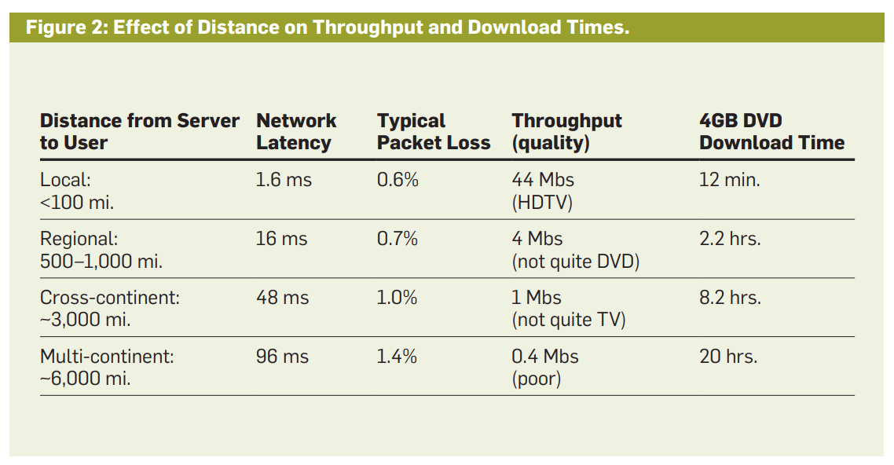
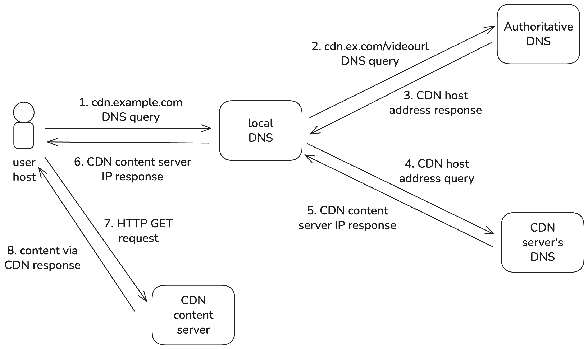
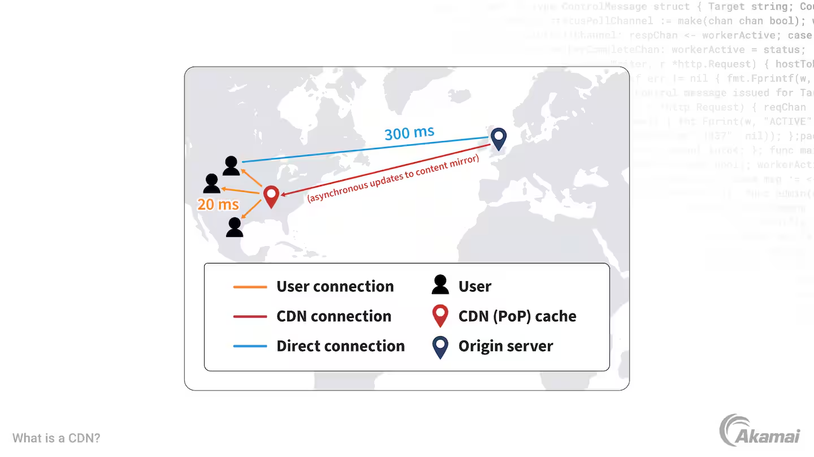

# CDN의 필요성

우리가 인터넷에서 웹사이트를 방문하고 콘텐츠를 볼 때면 어딘가에 있는 서버에서 데이터를 받아오게 된다. 이 글을 보고 있는 당신의 컴퓨터나 스마트폰에서도 이 블로그를 배포 중인 서버에서 콘텐츠 데이터를 받아오고 있다.

하지만 콘텐츠를 배포 중인 서버가 콘텐츠를 받을 컴퓨터와 멀리 떨어져 있다면 어떨까? 예를 들어 한국에 있는 내가 뉴욕에 있는 서버에서 배포되고 있는 콘텐츠를 받아오는 경우 말이다. 사실 꼭 한국-뉴욕이 아니더라도 해외 사이트에 있는 영상을 보는 경우는 인터넷을 사용한다면 한번쯤 경험해 봤을 일이다.

이론상으로는 데이터가 광속으로 전달되므로 콘텐츠가 멀리 떨어져 있어도 큰 문제가 없을 것 같다. 하지만 현실은 그렇지 않다. 데이터 패킷은 네트워크를 광속으로 통과하지만, 대용량 파일 하나를 지구 반대편으로 보내는 건 오랜 시간이 걸린다. 서버와 사용자 사이 거리가 늘어날수록 데이터 처리량(throughput)은 크게 줄어들기 때문이다.

100마일(약 160킬로미터) 떨어진 서버에서는 44Mbs의 처리량이 나오지만 6000마일(약 9600킬로미터, 지구 약 1/4바퀴) 떨어진 서버에서는 고작 0.4Mbs의 처리량이 나온다.[^1]

왜 이런 일이 생길까? 네트워크 프로토콜의 설계방식 때문이다. TCP 프로토콜은 데이터를 한번에 TCP 윈도우만큼의 데이터만 보낼 수 있고 원칙적으로는 수신 측에서 ACK를 보내야 다음 데이터를 보낼 수 있다. 이러한 통신 속도는 RTT(Round Trip Time, 왕복 시간)의 영향을 받는데 서버와 사용자 간 거리가 늘어나면 당연히 RTT는 늘어난다.

또한 TCP는 패킷 손실이 발생하면 재전송을 시도한다. 신뢰성 있는 데이터 전송 보장을 위해서이다. 그런데 이건 데이터를 전송하는 거리가 길어지면 지연 시간을 더욱 늘리는 원인이 되기도 한다. 데이터가 더 멀리 이동하면 거치는 Border gateway, 라우터, 케이블 같은 것도 늘어나고 패킷 손실이 발생할 확률도 높아지기 때문이다. 패킷 손실이 더 발생하면 재전송도 늘어나고 따라서 지연 시간도 늘어나는 것이다.

인터넷을 통해 콘텐츠를 주고받는 일이 늘어나면서 데이터 전송 거리에 따른 지연 시간이 병목으로 작용하는 경우가 많아졌다. 특히 이미지나 동영상 같은 대용량 콘텐츠를 로딩할 때는 더욱 그렇다. 그래서 등장한 게 CDN(Content Delivery Network)이다. 데이터 전송 거리에 따른 지연 시간을 줄이고 더 빠르게 콘텐츠를 제공하기 위한 방법. 이 블로그에서도 몇몇 이미지를 cloudinary라는 CDN 서비스를 통해 제공하고 있다.

그런데 CDN은 어떻게 콘텐츠를 빠르게 제공할 수 있는 걸까? CDN의 동작 원리를 알아보자.

# CDN의 기본

## CDN의 개요

CDN은 기본적으로 콘텐츠를 제공하는 서버와 사용자 간의 거리를 줄여서 콘텐츠를 빠르게 전달하는 네트워크이다. 이를 위해서 CDN 제공자들은 전 세계에 분산된 여러 서버에 콘텐츠 복사본을 저장하고 사용자의 요청이 들어오면 사용자에게 가장 빠르게 응답할 수 있는 서버에서 콘텐츠를 제공한다.

이렇게 할 수 있다면 장점이 많다. 먼저 사용자는 당연히 빠른 속도로 콘텐츠를 받아 볼 수 있기에 사용자 경험이 좋아진다. 이렇게 콘텐츠 로딩 속도가 빨라지면 페이지의 SEO(검색 엔진 최적화)에도 긍정적인 영향을 미친다. 검색 엔진은 페이지 로딩 속도를 중요한 요소로 고려하기 때문이다.

그리고 중앙 콘텐츠 서버에 대한 부하도 줄일 수 있고 서버 업타임도 높인다. 중앙 서버와의 직접 통신이 줄어들어 안정성, 보안성도 높아진다. 각 서버 클러스터에서 캐싱도 제공할 수 있고 대역폭 비용도 줄어든다.

그런데 문제는 어떻게 이런 좋은 서비스를 제공하는지이다.

## CDN의 동작 원리

콘텐츠 서버에 요청하고 콘텐츠를 받아오는 단순한 방식보다 빠르게 콘텐츠를 제공하기 위해서 CDN은 콘텐츠 요청을 가로채서 해당 요청을 가장 가까운 CDN 클러스터로 연결한다. 이 동작은 일반적으로 DNS를 활용한다.

사용자가 CDN에 저장된 콘텐츠를 요청한다고 하자. `cdn.example.com/videourl`이라는 도메인으로 요청을 보낸다고 말이다. 그러면 일단 사용자 호스트가 로컬 DNS 서버에 해당 도메인에 대한 질의를 보낼 것이다. 이후 이건 책임 DNS 서버로 전달되고 책임 DNS 서버는 CDN 제공자가 관리하는 서버 도메인을 로컬 DNS 서버에 응답한다.

그럼 이제 로컬 DNS 서버는 CDN 제공자가 관리하는 DNS 서버에 질의를 보내게 된다. 이 질의를 받은 CDN 제공자의 DNS 서버는 사용자 호스트의 IP 주소와 여러 정보를 기반으로 가장 빠른 응답을 보낼 수 있는 CDN 콘텐츠 서버의 IP 주소를 결정해 응답한다. 이렇게 CDN 제공자의 DNS가 응답한 IP 주소는 로컬 DNS를 거쳐서 사용자 호스트로 전달된다.

그럼 사용자 호스트는 이렇게 알게 된 CDN 콘텐츠 서버의 IP 주소로 콘텐츠 요청을 보낸다. 이때 CDN 콘텐츠 서버는 사용자 호스트의 요청에 대한 응답으로 콘텐츠를 제공하게 된다. 중앙 콘텐츠 서버보다 훨씬 사용자에게 가까이 있기 때문에 콘텐츠를 빠르게 제공할 수 있다. 이 모든 과정을 그림으로 나타내면 다음과 같다.

이때 CDN 제공자는 사용자에게 가장 빠르게 응답할 수 있는 서버를 찾기 위해 여러 가지 요인을 고려할 수 있다. 예를 들어 사용자의 IP 주소를 기반으로 지리적으로 가장 가까운 서버를 선택할 수도 있고 CDN 서버가 주기적으로 로컬 DNS 서버에 자신의 상태를 알리는 ping을 보내고 그 응답 시간을 기반으로 가장 빠른 서버를 선택할 수도 있다.

DNS가 가장 빠른 CDN 콘텐츠 서버를 찾아주는 것까지는 알았다. 그럼 이 CDN 콘텐츠 서버들은 어떻게 관리될까?

먼저 당연히 콘텐츠 원본을 관리하고 있는 서버가 있다. 이를 오리진 서버라고 한다. 그리고 오리진 서버의 콘텐츠 복사본을 캐싱하고 있는 엣지 서버(Point of Presence, PoP서버라고도 한다)들이 있다. 엣지 서버들은 전세계에 퍼져 있고 캐싱 콘텐츠가 오래되거나 오리진 서버의 콘텐츠가 변경되면 오리진 서버에서 콘텐츠를 가져와서 캐싱한다.

CDN 제공자는 엣지 서버 간에 콘텐츠를 동기화하는 방법을 제공한다. DNS는 앞서 보았듯이 사용자에게 가장 가까운 콘텐츠 서버를 찾아주는 역할을 한다.

## CDN 구조

CDN 구조는 엣지 서버에 콘텐츠를 캐싱하는 방식과 서버 위치에 따라 나뉜다.

먼저 콘텐츠를 캐싱하는 방식에 따른 분류는 간단하다. 원본 서버가 변경사항을 엣지 서버에 알려주는 push 방식, 엣지 서버가 원본 서버에 요청해서 콘텐츠를 가져오는 pull 방식이 있다.

각각의 장단점 또한 상식적인 흐름이다.

push 방식은 서버 자원이 많이 쓰이고 최초 구성도 복잡하지만 엣지 서버가 항상 최신 콘텐츠를 유지할 수 있고 콘텐츠가 업데이트되어도 서버 간 콘텐츠 불일치로 인한 문제가 적다.

반면 pull 방식은 어쨌든 엣지 서버가 요청이 있을 때만 원본 서버에서 콘텐츠를 가져오므로 서버 자원 사용이 적고 최초 구성도 간단하다. 하지만 응답 속도가 느려질 수 있고 엣지 서버가 항상 최신 콘텐츠를 유지하지 못할 수 있다. 또한 콘텐츠가 업데이트되었을 때 엣지 서버가 이를 인지하지 못하면 오래된 콘텐츠를 제공할 수도 있다.

서버 위치에 따른 분류는 Enter Deep, Bring Home으로 나뉜다.

먼저 Enter Deep은 CDN 서버 클러스터를 많은 곳에 배치해서 엣지 서버를 최대한 사용자 가까이에 위치시키는 방식이다. 주로 ISP 접속 네트워크 내에 서버를 배치한다. 당연히 사용자와 CDN 서버 간의 거리가 짧아지므로 콘텐츠를 빠르게 제공할 수 있다. 하지만 고도로 분산된 설계와 많은 엣지 서버를 관리하는 비용이 크다. Akamai가 Enter Deep 방식의 대표주자인데 전세계에 약 4000개 이상의 엣지 서버를 운영하고 있다.

반면 Bring Home은 좀 더 적은 수의 핵심 지점에 대규모 서버 클러스터를 배치하는 방식이다. 이 경우 일반적으로 IXP(Internet Exchange Point, 서로 다른 ISP나 CDN등의 인프라가 교차하는 지점)와 같은 핵심 네트워크 지점에 서버를 배치한다. 이 방식은 Enter Deep보다 관리가 용이하고 비용이 적게 든다. 하지만 사용자가 느끼는 지연 시간이 늘어나고 각 서버 클러스터에 걸리는 부하도 커질 수 있다.

이 서버 위치에 대한 접근은 두 가지 중에 극단적으로 하나만 택해야 하는 건 아니다. 두 가지를 혼합해서 사용하는 경우도 많다. 대표적으로 구글 같은 경우 ISP 네트워크 내에 수백 개의 엣지 서버를 배치하는 Enter Deep 방식을 사용하면서도 IXP와 같은 핵심 네트워크 지점에 약 90개의 대규모 서버 클러스터를 운영하는 Bring Home 방식을 혼합해서 사용한다.

# 참고

James F. Kurose, Keith W. Ross 지음, 최종원, 강현국, 김기태 외 5명 옮김, 컴퓨터 네트워킹 하향식 접근, 8판

IBM Technology, CDN(콘텐츠 전송 네트워크)이란 무엇입니까?

https://www.youtube.com/watch?v=Bsq5cKkS33I

IBM, What is a content delivery network (CDN)?

https://www.ibm.com/think/topics/content-delivery-networks

가비아 라이브러리, CDN 아키텍처

https://library.gabia.com/contents/infrahosting/9051/

Akamai, CDN(콘텐츠 전송 네트워크)이란 무엇일까요?

https://www.akamai.com/ko/glossary/what-is-a-cdn

Cloudflare, 콘텐츠 전송 네트워크(CDN)란? | CDN의 작동 방식은?

https://www.cloudflare.com/ko-kr/learning/cdn/what-is-a-cdn/

Paul Vixie, Internet Systems Consortium, "What DNS Is Not"

https://queue.acm.org/detail.cfm?id=1647302

Tom Leighton, "Improving Performance on the Internet"

https://www.akamai.com/site/en/documents/research-paper/improving-performance-on-the-internet-technical-publication.pdf

[^1]: Tom Leighton, "Improving Performance on the Internet", 3p Figure 2